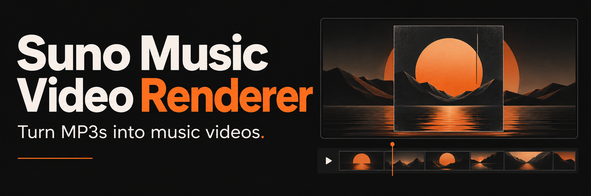
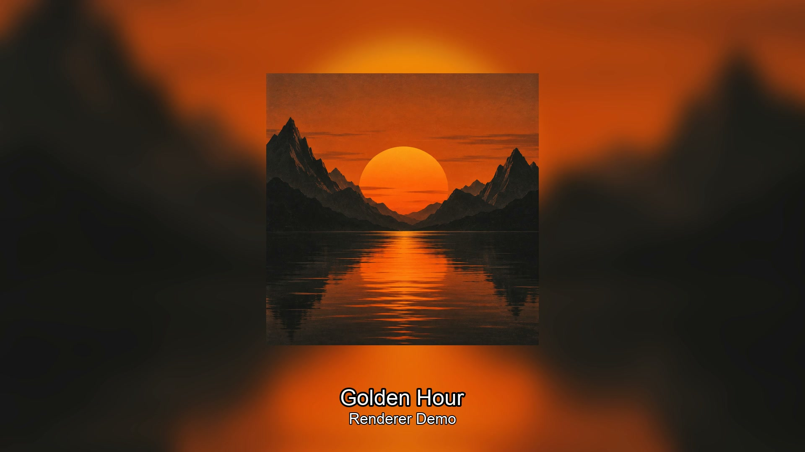

<div align="center">



# Suno Music Video Renderer

Turn Suno MP3 downloads into cover-art music videos and full-album MP4s.

[](./render_single.sh) [](#requirements) [](./LICENSE)

[Install](#install) · [Preview](#preview) · [Quick start](#quick-start) · [Commands](#command-reference) · [Limitations](#known-limitations)

</div>

Batch-render [Suno](https://suno.com) MP3 downloads into YouTube-style 1920×1080 music videos. Each video shows the embedded album art centered over a blurred/darkened version of itself as the background, with the song title and artist name in white text near the bottom of the frame.

## Output format

- **Resolution:** 1920×1080 (1080p)
- **Video:** H.264, 30fps, static frame (no waveform animation)
- **Audio:** AAC 192 kbps, re-encoded from the source MP3
- **Container:** MP4 with faststart (moov atom at front, YouTube-friendly)

## Install

```bash
git clone https://github.com/essremodel/suno-music-video-renderer.git
cd suno-music-video-renderer
brew install ffmpeg imagemagick
python3 -m venv .venv
source .venv/bin/activate
python -m pip install Pillow
```

This macOS setup installs the existing runtime dependencies in an isolated Python environment. Keep that environment active when running the shell scripts, which invoke `python3`. Check the [font paths](#font-paths) before your first render.

## Preview



*An actual frame extracted from a video produced by `render_single.sh`, using original generated artwork and synthetic audio. The renderer creates a static frame, not an animated visualizer. See [demo provenance](./assets/README.md).*

## Requirements

| Tool | Version | Notes |
|------|---------|-------|
| [ffmpeg](https://ffmpeg.org) | Any recent | Does **not** need `--enable-libfreetype` — text rendering uses Pillow instead |
| [ImageMagick 7](https://imagemagick.org) | 7.x (`magick` CLI) | Used for blur/composite; Freetype not required |
| Python 3 | 3.8+ | |
| [Pillow](https://pillow.readthedocs.io) | 9.2+ | `pip install Pillow` — handles all text rendering |

Install on macOS with Homebrew:

```bash
brew install ffmpeg imagemagick
pip3 install Pillow
```

### Font paths

By default `add_text.py` looks for `/Library/Fonts/Arial.ttf`. That path may not exist on your Mac. Set both font variables to existing files before rendering:

```bash
export TITLE_FONT=/path/to/your/font-bold.ttf
export ARTIST_FONT=/path/to/your/font.ttf
```

## Filename format

Scripts parse titles and artists from this filename convention:

```text
Song Title – Artist Name [hexhash].mp3
            ^
            en dash (U+2013), not a regular hyphen
```

The `[hexhash]` suffix is stripped from the displayed title. A spaced plain hyphen (` - `) is also accepted. If neither separator is found, the entire name (minus the hash) becomes the title and the artist becomes `Unknown Artist`.

## Quick start

Start with an MP3 that contains embedded cover art. The title and artist come from its **filename**, not its ID3 text tags. A song named `Golden Hour – Renderer Demo [abc12345].mp3` will display “Golden Hour” and “Renderer Demo”.

### Render a single track

```bash
./render_single.sh "AYO (Boots Rockin') – Big Eazy [751f3115].mp3"
# Output: ./rendered/AYO (Boots Rockin') – Big Eazy [751f3115].mp4
```

Custom output directory:

```bash
./render_single.sh --output-dir ~/Desktop/videos "My Song – Artist [abc123].mp3"
```

### Render all MP3s in a directory

```bash
cd /path/to/your/mp3s
/path/to/render_all.sh
```

Or specify paths explicitly:

```bash
./render_all.sh --input-dir ~/Music/Suno --output-dir ~/Desktop/videos
```

In batch mode, already-rendered files are skipped automatically. Delete the `.mp4` to force a re-render.

### Render all + concatenate into one full-album video

```bash
./render_all.sh --concat
# Renders all tracks, then produces: ./rendered/FULL_ALBUM_<dirname>.mp4
```

Tracks are concatenated alphabetically with a one-second black/silent gap between them. Existing `FULL_ALBUM_*` outputs and macOS `._*` files are excluded.

### Concatenate already-rendered files

```bash
./render_concat.sh ./rendered/
# Output: ./rendered/FULL_ALBUM_<cwd-name>.mp4
```

Custom output filename:

```bash
./render_concat.sh --output ~/Desktop/Big_Eazy_Full_Album.mp4 ./rendered/
```

## Command reference

### `render_single.sh`

```text
render_single.sh [OPTIONS] "Song Title – Artist [hash].mp3"

Options:
  --output-dir DIR   Output directory (default: ./rendered)
  -h, --help         Show help
```

### `render_all.sh`

```text
render_all.sh [OPTIONS]

Options:
  --input-dir  DIR   MP3 source directory (default: .)
  --output-dir DIR   Output directory     (default: ./rendered)
  --concat           Run render_concat.sh after all renders complete
  -h, --help         Show help
```

### `render_concat.sh`

```text
render_concat.sh [OPTIONS] [INPUT_DIR]

Arguments:
  INPUT_DIR          Directory of .mp4 files (default: ./rendered)

Options:
  --output FILE      Output filename (default: INPUT_DIR/FULL_ALBUM_<cwd>.mp4)
  -h, --help         Show help
```

### `add_text.py`

```text
add_text.py <frame_in> <frame_out> <title> <artist> [OPTIONS]

Options:
  --title-size N     Title font size px  (default: 52)
  --artist-size N    Artist font size px (default: 36)

Env vars:
  TITLE_FONT         Path to title font  (default: /Library/Fonts/Arial.ttf)
  ARTIST_FONT        Path to artist font (default: /Library/Fonts/Arial.ttf)
```

## How it works

Each `render_single.sh` call runs a four-step pipeline:

1. **`ffmpeg` — extract art**: Reads the MJPEG `attached_pic` stream embedded in the MP3 (embedded cover art is required; downloads without it fail) using `-map 0:v:0 -c:v copy`.

2. **`magick` — composite frame**: Scales the cover to fill 1920×1080 → applies a heavy gaussian blur (`-blur 0x30`) and slight darken (`-modulate 92`) for the background. Then overlays the original cover resized to 650px tall, centered and shifted 40px up.

3. **`add_text.py` — text overlay**: Opens the composite in Pillow and draws the song title (52px, white, stroke=4) and artist name (36px, white 85% opacity, stroke=2) centered near the bottom. Using Pillow instead of `ffmpeg drawtext` means no special-character escaping issues and no dependency on a Freetype-enabled ffmpeg build.

4. **`ffmpeg` — encode**: Loops the static frame at 30fps for the duration of the audio stream. Output is H.264/AAC in a faststart MP4.

## Known limitations

- **Static frame** — no waveform visualizer, spectrum, or animation. The video is a single still image for the full duration.
- **macOS font paths hardcoded** — `add_text.py` defaults to `/Library/Fonts/Arial.ttf`. Linux/Windows users must set `TITLE_FONT` / `ARTIST_FONT`.
- **Suno filename convention assumed** — the ` – ` en dash separator and `[hexhash]` suffix are expected. A spaced plain hyphen also works. Other formats use the filename without the hash as the title, with `Unknown Artist`.
- **Concatenation timestamps** — FFmpeg can report non-monotonic audio timestamps at joins, even with compatible short samples. Inspect the combined output; a successful exit is not a playback-quality guarantee.
- **No chapter markers** — the full-album concat output is a single continuous stream with no chapter metadata.
- **Concat requires compatible streams** — `render_concat.sh` uses `-c copy` (no re-encode). All source files must share the same codec, resolution, and framerate. The renderer fixes video settings, but source audio properties can differ. The generated inter-track gap uses stereo audio at 48 kHz; verify audio compatibility before concatenating. Mixing incompatible files may cause issues.

## Using Suno Downloader

[Suno Library Downloader](https://github.com/essremodel/suno-downloader) can supply MP3s and attempts to embed cover art. Its filenames use `Song Title [clipId8].mp3`, without the artist separator expected here. Rename a copy to the convention above if you want an artist label, and check that cover art is present: Downloader's fallback can save an untagged file.

## Contributing

See [CONTRIBUTING.md](./CONTRIBUTING.md) for syntax checks, sample-render verification, and documentation maintenance.

## License

[MIT](./LICENSE). Copyright and terms remain in the existing license file.
